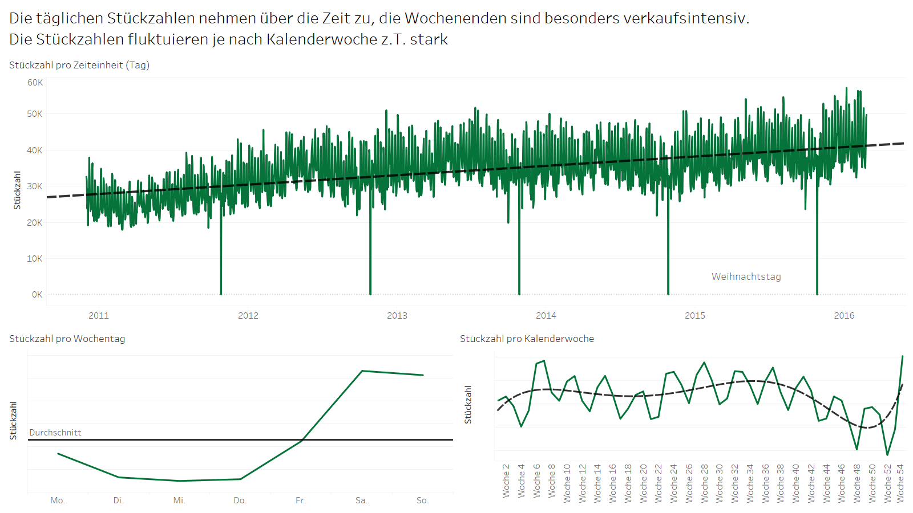
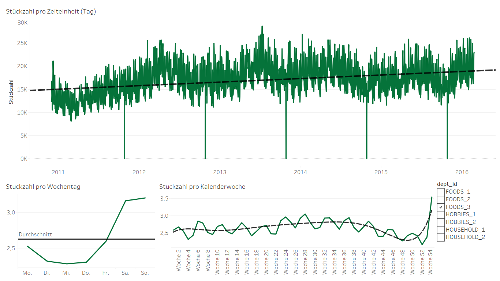
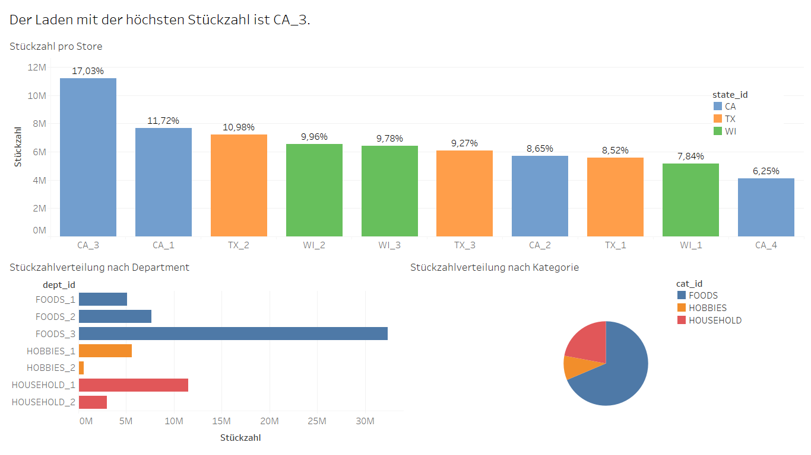

<style>
body {
text-align: justify}
</style>

<br>

# Problemstellung: Die M5 Accuracy Challenge <a name="the-challenge"></a>

Walmart ist der grösste Einzelhändler der Welt. In ca. 11.500 Stores in 27 Ländern kaufen jede Woche über 250 Mio. Kunden Lebensmittel und Waren aller Art ein. Walmart betreibt in erster Linie sogenannte Superstores, die sich durch eine sehr grosse Produktpalette auszeichnen. Gerade durch die extreme Produktvielfalt sind die Lagerkosten für Walmart enorm. Daher ist das Unternehmen besonders daran interessiert, so wenig Produkte wie möglich, aber trotzdem so viele wie nötig auf Vorrat zu halten.  

Aus diesem Grund hat Walmart die M5 Accuracy Challenge auf Kaggle gestartet. Ziel der Challenge ist die möglichst genaue Vorhersage von Absatzzahlen. Im Zuge dessen sollen die Stückzahlen für Produkte aus den drei Produktkategorien Food, Household und Hobby in 10 Stores in 3 US-Staaten für 28 Tage, also 4 Wochen, vorhergesagt werden. Die Besonderheit der aktuellen Challenge im Vergleich zu früheren Challenges ist, dass mit Intermittenz  (einschliesslich 0 Werte) umgegangen werden muss. Der Datensatz enthält also Produkte mit sporadischer Nachfrage, deren Absatzvorhersage wesentlich komplexer ist, als die Vorhersage für Produkte, die regelmässiger abgesetzt werden. Die Kaggle-Challenge ist mit 50.000 USD Preisgeld dotiert.


[Link zur Challenge auf Kaggle](https://www.kaggle.com/c/m5-forecasting-accuracy)

<br>

# Vorbereitung von R  <a name="R-Vorbereitung"></a>
Für die weitere Ausführung des Codes müssen zunächst einige Packages initialisiert werden. Außerdem werden Helper-Functions für die weitere Verwendung im Code definiert.
<br>

## R Libraries

```{r Importing Libraries, eval = FALSE, echo = TRUE, error = FALSE}
#importing relevant libraries
library(tidyverse)
library(data.table)
library(dplyr)
library(janitor)
library(forecast)
library(xgboost)
library(Matrix)
library(caret)
library(ranger)
library(parallel)
```

<br>

## Definition von Hilfsfunktionen
```{r Helper Functions, eval = FALSE, echo = TRUE}  
#define function for clearing memory
free <- function() invisible(gc())

#define mode function to find most frequent value
Mode <- function(x) {
  ux <- unique(x)
  ux[which.max(tabulate(match(x, ux)))]
}

#define method for RMSE calculation
RMSE=function(actual, predicted){
  rmse = sqrt(mean((actual-predicted)^2))
  return(rmse)
}
```
<br>

#  Preprocessing des Datensatzes  <a name="import"></a>

## Beschreibung des Datensatzes
Walmart stellt zur Bearbeitung der Challenge mehrere Datensätze zur Verfügung, die wir zur Bearbeitung zusammengefügt haben.

**calender.csv** stellt Informationen über die Verkaufstage bereit. Dieser Datei ist unter anderem der Wochentag zu entnehmen und ob es sich bei dem Tag um einen Feiertag handelt.

**sales_train_validation.csv** enthält die Verkaufszahlen pro Produkt auf Tagesbasis.

**sell_prices.csv** enthält die Preisinformationen nach Produkt.
  
  
Insgesamt werden 3.049 Produkte in 10 Stores betrachtet. Der Datensatz hat folgende Features:  
**id**: Dieses Feature beschreibt das Produkt, das Department, die Kategorie, den Store und den Staat, in dem das Produkt verkauft worden ist.   
**item_id**: Dieses Feature benennt das verkaufte Item.  
**cat_id**: Dieses Feature gibt Auskunft darüber, ob es sich beim Produkt um ein Food-Item, ein Hobby-Item oder ein Household-Item handelt.  
**dept_id**: Dieses Feature beschreibt die zugeordnete Kategorie näher. Pro Kategorie gibt es mehrere Departments.  
**store_id**: Die Store-ID gibt Auskunft, in welchem Laden das Produkt verkauft worden ist. Insgesamt umfasst der Datensatz Informationen zu Verkäufen in zehn Stores.  
**state_id**: Dieses Feature verrät, in welchem der drei betrachteten Staaten das Produkt verkauft worden ist - Kalifornien, Texas oder Wisconsin.  
**sales**: Dieses Feature gibt Auskunft, wie hoch die Anzahl der Verkäufe des Produkts in einem bestimmten Store an einem bestimmten Tag war.  
**date**: Date benennt das Jahr, den Monat und den Tag des Verkaufs.  
**sell_price**: Dieses Feature stellt den Stückpreis des Produkts dar.  

Im Kalender sind noch weitere Features enthalten, auf welche wir nicht weiter eingegangen sind. Dies sind zum Beispiel Feiertage, sowie die Kodierung in Wochentage.
<br>

## Visualisierung des Datensatzes
Zur Visualisierung des Datensatzes haben wir Tableau verwendet. Hier war es uns besonders wichtig, herauszufinden, welche Trends und Schwankungen die Absätze aufweisen. Für das Preprocessing des Datensatzes, welches Grundlage für die Visualisierung in Tableau war, haben wir uns an folgendem [Kaggle Notebook](https://www.kaggle.com/mayer79/m5-forecast-tidy-r-catboost) orientiert.
<br>

### Analyse der Stückzahlen des gesamten Datensatzes

In diesem Dashboard zeigen wir die aggregierten Volumina der Verkäufe. Es fällt auf, dass die Stückzahlen über die Zeit zunehmen. Die Wochenenden sind besonders umsatzstark, was intuitiv logisch erscheint. Zusätzlich fällt auf, dass die Stückzahlen pro Kalenderwoche stark schwanken - auch das lässt sich intuitiv gut erklären: Walmarts Zielgruppe sind vor allem Personen mit geringem Einkommen, in dieser Zielgruppe nehmen die zur Verfügung stehenden Mittel im Lauf des Monats ab.
<br>

### Drill Down Trends


Das zweite Dashboard zeigt den selben Zusammenhang, allerdings ist hier ein Drill-Down möglich. Je nach Kategorie und Dept. unterscheiden sich die Umsatztrends leicht voneinander. Ein genauerer Drill-Down ist in der PPT und in Tableau möglich.
<br>  

### Absatzverteilung nach Stores

Das dritte Dashboard zeigt auf, wie viele Produkte pro Store verkauft worden sind und wie gross der Anteil jedes einzelnen Stores am Gesamtabsatzvolumen war. Zusätzlich erlaubt ein Drill-Down, die Absätze nach Department und nach Kategorie zu betrachten. Es zeigt sich hier, dass Store CA_3 für 17% des Volumens verantwortlich ist. Aufgrund der enormen Größe des Datensatzes und der beschränkten Rechenleistung unserer PCs, mussten wir uns auf einen bestimmten Teil des Datensatzes fokusieren. Wegen des hohen Volumenanteils des Stores CA_3 haben wir uns für diesen Store für eine genaure Betrachtung entschieden.

<br>

## Import der Datensätze für die Vorhersagen
Zunächst müssen die Datensätze geladen werden. Insgesamt werden drei Datensätze mit den vorher besprochenen Features geladen. Diese stellen die Grundlage für die weiteren Analyseschritte dar. Wie vorher besprochen fokussieren wir uns auf die Verkäufe im Store CA_3 aufgrund der beschränkte Rechenleistung. Um die Berechnung zusätzlich zu beschleunigen, werden nur die letzten 1,5 Jahre für das Training verwendet (Ab Tag 1431). Die letzten 28 Tage dienen als Testset.
```{r read in the data, eval = FALSE, echo = TRUE}  
#read in the data 
sales_train_validation.csv <- fread("sales_train_validation.csv", stringsAsFactors = TRUE)
calendar.csv <- fread("calendar.csv", stringsAsFactors = TRUE)
sell_prices.csv <- fread("sell_prices.csv", stringsAsFactors = TRUE)
```


<br>

## Erstellung eines simplen Datensets für naive Ansätze
Aufgrund der verschiedenen Analyse-Ansätze werden insgesamt zwei Datensätze erstellt, da für die jeweiligen Ansätze ein unterschiedliches Datenformat benötigt wird.
Für die simpleren Ansätze (Naive, Snaive und Arima) stellen nur die jeweiligen Verkäufe der Vergangenheit des einzelnen Produktes die Trainingsgrundlage dar. Jede Spalte des simpleren Datensets entspricht hier den vergangenen Käufen eines Produktes. Insgesamt hat der Datensatz so 3049 Spalten für die 3049 Produkte.
```{r Creating simple dataset, eval = FALSE, echo = TRUE}  
#create simple dataset (for naive, snaive and arima)
simple_dataset <- sales_train_validation.csv %>% 
  #eliminate validation to save memory
  mutate(id = gsub("_validation", "", id)) %>%
  select(-item_id) %>% 
  select(-dept_id) %>%
  select(-cat_id) %>%
  #filter for specific store
  filter(store_id == "CA_3") %>%
  #eliminate further columns
  select(-store_id) %>%
  select(-state_id) %>%
  mutate_if(is.factor, as.integer)


#clear the memory
free()

#transpose the data
simple_dataset = t(simple_dataset)
free()

#write first row as column header
simple_dataset <- simple_dataset %>%
  row_to_names(row_number = 1)

#only leave last 1,5 years for training as the years before might not be relevant, and due to memory constraints
simple_dataset = simple_dataset[-c(1:1430),]

#create training data for simple_dataset -> Last 28 days should be predicted
index = tail(1:nrow(simple_dataset),28)
train_simple = simple_dataset[-index,]
test_simple = simple_dataset[index,]
```
<br>

## Erstellung der komplexen Datensets für ML Ansätze
Für die komplexeren Ansätze (XGBoost und Random Forest) sollen zusätzlich noch Features erstellt werden, um bessere Forecast-Ergebnisse zu erzielen. Damit diese auch berechnet werden können wird der train_index schon bei Tag 1350 gesetzt, um eine korrekte Berechnung aller Features gewährleisten zu können. 

Diese Features umfassen die Lags der Tage 1-7 sowie die einzelnen Lags von 14, 21 und 28 Tagen. Dabei handelt es sich zum einen um häufig verwendete Lags in Time Series Forecast Ansätzen, und zum anderen hat die Visualisierung des Datensatzes eine starke wöchentliche Saisonalität gezeigt. Zusätzlich haben wir den Durchschnitt der vergangenen 3 und 7 Tage errechnet. Abschließend haben wir noch einige weitere Features in Bezug auf vergangenen Absatz des Produktes. Gerade letztere sollen als Indikation für mögliche Grenzen in Bezug auf die Vorhersage gelten. Falls ein Produkt  in der Vergangenheit nicht mehr als 5-mal an einem Tag verkauft worden ist, sollte die Wahrscheinlichkeit eines vorhergesagten Absatz von mehr als 5 Verkäufen an einem Tag gering sein. 

Nach dem Filtern auf den Store CA_3 werden die nun irrelevanten Variablen store- und state-id entfernt, da nur noch ein Store betrachtet wird. Außerdem wurden die Variablen der jeweiligen Kategorien und Departements aufgrund keiner Verbesserung der Vorhersage entfernt.  

Um später auf alle Items im For-Loop zugreifen zu können, wird ein Data-Frame mit der Item-Id des jeweiligen Produktes erstellt.  
Abschließend sollen Test- und Trainings-Daten erstellt werden. Als Trainingsdaten dienen die Tage 1431-1885. Aufgrund der etwas komplizierteren Vorgehensweise bezüglich der iterativen Berechnung der Features für die ML-Ansätze, gestaltet sich die Erstellung des Testdatensatzes etwas komplexer, weshalb insgesamt 3 Teil-Datensätze benötigt werden. Intermediate_test_dataset_1 dient hierbei nur als Grundlage für die Berechnung aller Lags und umfasst Daten von Tag 1800-1885. Intermediate_test_dataset_2 umfasst hier den ersten Tag (1886) für die Vorhersage, für welchen noch alle Lags vorhanden sind. Dies ist für die weiteren Tage danach, welche das test_dataset umfassen nicht mehr der Fall. Diese werden deshalb für alle Tage aus dem Datensatz gelöscht und später iterativ berechnet, worauf noch näher im Folgenden eingegangen werden soll. Abschließend werden alle drei Test-Datensätze zusammengefügt. So entsteht nun das komplette Testset. 
Für das Preprocessing des Datensatzes für die ML-Ansätze haben wir uns an folgendem [Kaggle Notebook](https://www.kaggle.com/nonserial/m5-accuracy-mlr3learners-lightgbm-r-package) orientiert.

```{r Creating complex dataset, eval = FALSE, echo = TRUE}  
#create complex dataset
dataset <- data.table::melt.data.table(
  data = sales_train_validation.csv,
  id.vars = colnames(sales_train_validation.csv)[grepl("id", colnames(sales_train_validation.csv))],
  measure.vars = colnames(sales_train_validation.csv)[grepl("^d_", colnames(sales_train_validation.csv))],
  variable.name = "d",
  value.name = "demand",
  na.rm = FALSE
)

#remove csv and clear memory
free()

# make data smaller
dataset[, ("d") := as.integer(gsub("^d_", "", get("d")))]
free()

# ensure order
data.table::setorder(
  x = dataset,
  cols = "d"
  )
free()

#Make sure the dataset is sorted correctly
stopifnot(!is.unsorted(dataset$d))

# define indices for prediction/evaluation, training and testing set

# use the last 1.5 yrs for training -> Full 2015 + Half 2016 use a little more data to avoid NAs for lag
train_index <- 1350 
test_index <- (1913-28) #predict the last 28 days

# reduce data
dataset <- dataset[get("d") >= train_index, ]
free()

#merge the calendar
calendar.csv[, `:=` (weekend = ifelse(get("weekday") %in% c("Saturday", "Sunday"), 1L, 0L),
                     d = as.integer(gsub("^d_", "", get("d"))),
                     day = as.integer(substr(get("date"), start = 9, stop = 10)),
                     date = factor(as.Date(get("date"))),
                     event_name_1 = as.integer(factor(get("event_name_1"))),
                     event_type_1 = as.integer(factor(get("event_type_1"))),
                     event_name_2 = as.integer(factor(get("event_name_2"))),
                     event_type_2 = as.integer(factor(get("event_type_2"))))][
                       , `:=` (date = NULL,
                               weekday = NULL)
                       ]

# merge calendar to dataset
dataset <- calendar.csv[get("d") >= train_index, ][dataset, on = "d"]
free()


# merge prices to dataset
dataset <- sell_prices.csv[dataset, on = c("store_id", "item_id", "wm_yr_wk")][, wm_yr_wk := NULL]
free()

# create more features
demand_features <- function(X) {
  X %>% 
    group_by(id) %>% 
    #create some lag variables 
    mutate(
      lag_1 = dplyr::lag(demand, 1),
      lag_2 = dplyr::lag(demand, 2),
      lag_3 = dplyr::lag(demand, 3),
      lag_4 = dplyr::lag(demand, 4),
      lag_5 = dplyr::lag(demand, 5),
      lag_6 = dplyr::lag(demand, 6),
      lag_7 = dplyr::lag(demand, 7),
      mean_last3 = (lag_1+lag_2+lag_3)/3,
      mean_last7 = (lag_1+lag_2+lag_3+lag_4+lag_5+lag_6+lag_7)/7,
      lag_14 = dplyr::lag(demand, 14),
      lag_21 = dplyr::lag(demand, 21),
      lag_28 = dplyr::lag(demand, 28)) %>% 
    ungroup()%>%
    
    #create more features regarding the demand
    group_by(item_id)%>%
    mutate(
      demand_min = min(demand, na.rm = FALSE),
      demand_mean = mean(demand, na.rm = FALSE),
      demand_median = median(demand, na.rm = FALSE),
      demand_max = max(demand, na.rm = FALSE),
      demand_mode = Mode(demand),
      demand_sd = sd(demand, na.rm = FALSE)
    )%>%
    ungroup()
}

#create features before reducing dataset to avoid NAs
dataset <- dataset %>%
  demand_features()

#clear memory and remove CSV
rm(sales_train_validation.csv)
rm(calendar.csv)
rm(sell_prices.csv)
free()

#filter only the items of store CA_3
dataset = filter(dataset, store_id == "CA_3")

#drop unnessecary colums store_id, state id, cat_id, dept_id & id
dataset = select(dataset, -store_id)
dataset = select(dataset, -state_id)
dataset = select(dataset, -cat_id)
dataset = select(dataset, -dept_id)
dataset = select(dataset, -id)

#clear memory again
free()

#convert item id of the dataset into numeric format 
dataset$item_id = as.integer(dataset$item_id)

#create training for the more complex dataset
#create a list of all the items
item_id_df <- data.frame(dataset$item_id)
item_id_df <- unique(item_id_df)

#split the training data
#split the training data
train_dataset = filter(dataset, d >= 1431 & d < 1886)
intermediate_test_dataset_1 = filter(dataset, d >= 1800 & d <= 1885)
intermediate_test_dataset_2 = filter(dataset, d == 1886)
test_dataset = filter(dataset, d > 1886)

#clear memory
free()

#remove demand and all the lag metrics from the testset as they would not be available with the exception of the first day (1886)
test_dataset[,17:34] <-NA
intermediate_test_dataset_1 = rbind(intermediate_test_dataset_1,intermediate_test_dataset_2, test_dataset)

#rename complete dataset
complete_test_dataset = intermediate_test_dataset_1
```

<br>
<br>

# Iteratives Forecasting für die einzelnen Produkte <a name="forecast"></a>

## Vorbereitung für das iterative Forecasting
```{r Looping through the data, eval = FALSE, echo = TRUE, error = FALSE}
iterations = 3049   # number of products

#preparation for looping through the data
#create results matrix
results_matrix <- matrix(ncol=6, nrow=iterations)
results_matrix[,6]= item_id_df$dataset.item_id

#detect the number of cores for multicore operation
N_cpu = detectCores()
```

Bei der Auswahl der Forecasting-Ansätze war das Ziel ein breites Spektrum verschiedener Forecasting Methoden abzudecken. Die simpleren Ansätze umfassen hierbei Naive, Snaive und AutoARIMA. Die ersten beiden dienten als Benchmark für die weiteren Ansätze und treffen Vorhersagen auf Basis von sehr einfachen Regeln. 

<br>

## Iteratives Forecasting
Insgesamt sollen die Forecasts für 3049 Produkte erstellt werden. Um die Ergebnisse zu speichern wird eine Matrix mit 6 Spalten angelegt. In den ersten 5 Spalten werden die Ergebnisse des jeweiligen Forecasting-Ansatzes gespeichert, wobei die letzte Spalte die Item-Id des jeweiligen Produktes angibt. Um außerdem auf mehrere CPU Kerne zurückgreifen zu können wird die Anzahl an Kernen bestimmt, um schnellere Berechnungen zu ermöglichen.

ARIMA haben wir gewählt, weil es sich dabei um einen klassischen und dennoch performanten Ansatz handelt, der uns in der Vorlesung nahegelegt worden ist. Zusätzlich haben wir zwei Machine Learning Ansätze verwendet, die wir in der Vorlesung besprochen haben: XGBoost und Random Forest. Beide Ansätze basieren auf Decision Trees.
<br>

### Simple Forecasting Ansätze: Naive, Snaive und Arima
Die simplen Forecasting Ansätze folgen jeweils einer ähnlichen Struktur und besitzen die gleiche Vorbereitung der Daten. Für jede Iteration wird die i-te Spalte des Training- und Test-Datensets ausgewählt. Zum Training der Modelle wird dann ein Time-Series Objekt erstellt. Daraufhin folgt für die Ansätze Naive und Snaive direkt die Prediction, wogegen bei AutoARIMA zunächst ein Auto-Arima Model erstellt wird. Basierend auf diesem Modell wird dann auch für AutoARIMA eine Vorhersage getroffen. Für alle drei Ergebnisse wird abschließend der RMSE berechnet und in die Resultate-Matrix geschrieben.
<br>

### ML-Forecasting Ansätze: Random Forest und XGBoost
Für die ML-Forecasting Ansätze wird auf die Ansätze Random Forest und XGBoost zurückgegriffen. Für die Implementierung des Random Forests wird das Ranger-Paket aufgrund seiner schnelleren Berechnung verwendet, was gerade bei mehr als 3000 Produkten enorm wichtig ist. Für XGBoost wurde außerdem noch mit Hilfe von Grid-Search versucht, optimale Hyper-Parameter zu finden (Siehe R-Script/XGBoost_Grid-search_loop.R - [Link zum R Skript](R-Script/XGBoost_Grid-Search_loop.R)). 

Für jede Iteration wird zunächst das jeweilige Produkt aus dem Item-Id-Dataframe ausgewählt und basierend auf diesem die jeweils relevanten Daten für das Training gefiltert. Für Random Forest wird außerdem noch die Sell-Price Spalte entfernt, da in dieser sporadische NA-Werte auftreten. Für die XGBoost-Implementierung werden die Daten in das XGBoost Format umgewandelt. Außerdem werden dem XGBoost-Model zusätzlich noch die vorher bestimmten Hyper-Parameter bestimmt.  

Im nächsten Schritt wird für den jeweiligen Ansatz und das jeweilige Produkt nun ein Modell erstellt.  Die Erstellung des Testsets folgt einem ähnlichen Muster wie die Erstellung des Training-Datensatzes. Zusätzlich werden noch die bereits berechneten Statistiken bezüglich der Verkaufszahlen hinzugefügt und das Demand-Label entfernt. 

Das Update der Features gestaltet sich nun etwas komplexer, da dieses für den jeweiligen Tag einzeln berechnet wird. Hierzu muss zunächst jeder Tag einzeln herausgefiltert werden. Basierend auf dem einzelnen Tag wird nun für die beiden Modelle eine Prediction durchgeführt. Einerseits wird der vorhergesagte Wert für den einzelnen Tag in die predictions_matrix geschrieben, um diese später mit den tatsächlichen Werten abzugleichen. Andererseits dient die Prediction dazu die Features neu zu berechnen. Es gilt deshalb: Je später die Iteration, desto eher beruhen die berechneten Features auf den durchgeführten Vorhersagen und werden somit etwas ungenauer. Dieser For-Loop wird für jeden der 28 Tage wiederholt.  
Abschließend wird wie für die simpleren Ansätze auch für die ML-Ansätze der RMSE berechnet und in die Results-Matrix geschrieben. Der Loop wird insgesamt 3049 mal durchgeführt, um Vorhersagen für jedes Produkt einzeln zu erstellen.

```{r The Loop, eval = FALSE, echo = TRUE, error = FALSE}
i=1
#loop through the data
for (i in 1:iterations){
  #########################################################################################
  ### Data Preparation for simple approaches
  #########################################################################################
  iteration_start_time <- Sys.time()
  #create training data frame
  new_train = train_simple[,i]
  #convert data
  new_train <- as.numeric(new_train)
  new_train <- as.data.frame(new_train)
  #rename column
  names(new_train)[1] <- "quantity"
  
  #create dataframe for test
  new_test = test_simple[,i]
  new_test <- as.numeric(new_test)
  new_test <- as.data.frame(new_test)
  names(new_test)[1] <- "quantity"
  
  # Create time series data
  train_product_ts = ts(new_train$quantity, frequency = 7)
  
  #########################################################################################
  ### Naive Forecast
  #########################################################################################
  
  #make forecast and assess RMSE
  predicted = naive(train_product_ts, h = 28)$mean
  
  #convert to df for further calculations
  predicted_df = as.data.frame(predicted)
  
  
  #calculate rmse 
  actual = new_test[,1]
  predicted = predicted_df[,1]
  performance = RMSE(actual, predicted)
  
  #write performance into results matrix
  results_matrix[i,1] = performance
  
  #########################################################################################
  ### SNaive Forecast
  #########################################################################################
  
  #make forecast and assess RMSE
  snaive_predicted = snaive(train_product_ts, h = 28)$mean
  
  #convert to df for further calculations
  snaive_predicted_df = as.data.frame(snaive_predicted)
  
  
  #calculate rmse 
  actual = new_test[,1]
  snaive_predicted = snaive_predicted_df[,1]
  performance = RMSE(actual, snaive_predicted)
  
  #write results into results matrix
  results_matrix[i,2] = performance
  
  #########################################################################################
  ### ARIMA Forecast
  #########################################################################################
  
  #only try, as there is sometimes an error (like element 340)
  try({
    autoarima = auto.arima(train_product_ts)
    autoarima_predicted = forecast(autoarima, train_product_ts, h = 28)$mean
    
    #convert to df for further calculations
    autoarima_predicted_df = as.data.frame(autoarima_predicted)
    
    #loop to calculate rmse for every day
    actual = new_test[,1]
    autoarima_predicted = autoarima_predicted_df[,1]
    performance = RMSE(actual, autoarima_predicted)
    
    #write results into results matrix
    results_matrix[i,3] = performance
  }, silent = FALSE)
  
  
  #########################################################################################
  ### Random Forest Forecast
  #########################################################################################
  ##select item from item list
  item_id = item_id_df[i,1]
  
  #filter for the item variable to get the train set 
  subset_train = filter(train_dataset, item_id == !!item_id)
  subset_train_df = as.data.frame(subset_train)
  
  #remove price to avoid missing values
  subset_train_df = select(subset_train_df,-sell_price)
  
  #create model
  rangermodel = ranger(formula = demand~ ., data=subset_train_df, num.trees = 1000, num.threads = N_cpu)
  
  #initialize predictions matrix to store individual predictions
  predictions_matrix_rf = matrix(nrow = 28, ncol = 1)
  
  #filter for the item variable to get the test set 
  subset_test = filter(complete_test_dataset, item_id == !!item_id)
  
  #convert to df
  subset_test_df = as.data.frame(subset_test)
  
  #remove price to avoid missing values
  subset_test_df = select(subset_test_df,-sell_price)
  
  #create label for the last 28 predictions
  subset_test_label = tail(subset_test_df$demand,28)
  
  #Fill the last 28 predictions with missing values
  subset_test_df[87:114,]$demand <- NA
  
  #fill the statistics of the demand into the dataframe
  subset_test_df[87:114,]$demand_min = subset_test_df[86,]$demand_min
  subset_test_df[87:114,]$demand_max = subset_test_df[86,]$demand_max
  subset_test_df[87:114,]$demand_median = subset_test_df[86,]$demand_median
  subset_test_df[87:114,]$demand_mean = subset_test_df[86,]$demand_mean
  subset_test_df[87:114,]$demand_sd = subset_test_df[86,]$demand_sd
  subset_test_df[87:114,]$demand_mode = subset_test_df[86,]$demand_mode
  
  #predict in loop
  x = 1
  for (x in 1:28) {
    # 1885 is the last training day
    counter = 1885 + x  
    
    #only filter one day for the testset
    test_1_day = filter(subset_test_df, d == !!counter)
    
    #predict -> mit test_1 
    pred_rf = predict(rangermodel,data = test_1_day)
    #write in predictions matrix
    predictions_matrix_rf[x,1] = pred_rf$predictions
    #update dataframe with predicted demand
    current_day = 86 + x #86 is the row last training day
    
    #substitution for prediction -> Demand is in column 15
    subset_test_df[current_day,15] = pred_rf$predictions
    
    #select the next day to calculate lags
    next_day = current_day +1
    
    if(next_day < 115){
      #calculate lag for next day
      subset_test_df[next_day,]$lag_1 = subset_test_df[(next_day-1),]$demand
      subset_test_df[next_day,]$lag_2 = subset_test_df[(next_day-2),]$demand
      subset_test_df[next_day,]$lag_3 = subset_test_df[(next_day-3),]$demand
      subset_test_df[next_day,]$lag_4 = subset_test_df[(next_day-4),]$demand
      subset_test_df[next_day,]$lag_5 = subset_test_df[(next_day-5),]$demand
      subset_test_df[next_day,]$lag_6 = subset_test_df[(next_day-6),]$demand
      subset_test_df[next_day,]$lag_7 = subset_test_df[(next_day-7),]$demand
      subset_test_df[next_day,]$lag_14 = subset_test_df[(next_day-14),]$demand
      subset_test_df[next_day,]$lag_21 = subset_test_df[(next_day-21),]$demand
      subset_test_df[next_day,]$lag_28 = subset_test_df[(next_day-28),]$demand
      
      #calculate means
      subset_test_df[next_day,]$mean_last3 = (subset_test_df[next_day,]$lag_1 +
                                                subset_test_df[next_day,]$lag_2 +
                                                subset_test_df[next_day,]$lag_3)/3
      subset_test_df[next_day,]$mean_last7 = (subset_test_df[next_day,]$lag_1 + 
                                                subset_test_df[next_day,]$lag_2 + 
                                                subset_test_df[next_day,]$lag_3 +
                                                subset_test_df[next_day,]$lag_4 + 
                                                subset_test_df[next_day,]$lag_5 + 
                                                subset_test_df[next_day,]$lag_6 +
                                                subset_test_df[next_day,]$lag_7)/7
    }
    
    
  }
  
  
  
  #calculate RMSE
  actual = as.matrix(subset_test_label)
  predicted = predictions_matrix_rf
  performance = RMSE(actual, predicted)
  
  #write results into results matrix
  results_matrix[i,4] = performance
  
  
  #########################################################################################
  ### ML Approach Forecast: XGboost 
  #########################################################################################
  ##select item from item list
  item_id = item_id_df[i,1]
  
  #filter for this variable to get the train set 
  subset_train = filter(train_dataset, item_id == !!item_id)
  subset_train = as.data.frame(subset_train)
  
  #assign label
  train_label = subset_train$demand
  
  #remove label from dataset
  xg_train_dataset = select(subset_train, -demand)
  
  #convert datasets to matrix
  x_train = as.matrix(xg_train_dataset)

  #create input for xgboost
  trainDMatrix <- xgb.DMatrix(data = x_train, label = train_label)
  
  #set the parameter
  params <- list(booster = "gbtree",
                 objective = "reg:linear",
                 eval_metric = "rmse",
                 eta = 0.05,
                 max_depth = 1,
                 min_child_weight = 8,
                 colsample_bytree = 1,
                 gamma = 0.15,
                 subsample = 0.8
  )
  
  xgb.tab <- xgb.cv(data=trainDMatrix, param = params, evaluation = "rmse", nrounds = 100
                    , nthreads = N_cpu, nfold = 5, early_stopping_round = 10, verbose = 0)
  
  #build the model
  model_xgb <- xgboost(data = trainDMatrix,
                       param = params,
                       nrounds = xgb.tab$best_iteration,
                       importance = TRUE,
                       verbose = 0)
  
  #initialize predictions matrix to store individual predictions
  predictions_matrix_xgb = matrix(nrow = 28, ncol = 1)
  
  #filter for the item variable to get the test set 
  subset_test = filter(complete_test_dataset, item_id == !!item_id)
  
  #convert to df
  subset_test_df = as.data.frame(subset_test)
  
  #create label for the last 28 predictions
  subset_test_label = tail(subset_test_df$demand,28)
  
  #fill the last 28 predictions with missing values
  subset_test_df[87:114,]$demand <- NA
  
  #fill the statistics of the demand into the dataframe
  subset_test_df[87:114,]$demand_min = subset_test_df[86,]$demand_min
  subset_test_df[87:114,]$demand_max = subset_test_df[86,]$demand_max
  subset_test_df[87:114,]$demand_median = subset_test_df[86,]$demand_median
  subset_test_df[87:114,]$demand_mean = subset_test_df[86,]$demand_mean
  subset_test_df[87:114,]$demand_sd = subset_test_df[86,]$demand_sd
  subset_test_df[87:114,]$demand_mode = subset_test_df[86,]$demand_mode
  
  #predict in loop
  x = 1
  for (x in 1:28) {
    # 1885 is the last training day
    counter = 1885 + x  
    
    #only filter one day for the testset
    test_1_day = filter(subset_test_df, d == !!counter)
    
    #remove demand column
    test_1_day = select(test_1_day, -demand)
 
    #convert to matrix 
    test_1_day_matrix = as.matrix(test_1_day)

    #predict -> mit test_1 
    xgb_predicted = predict(model_xgb, newdata = test_1_day_matrix)
    
    #convert to matrix
    xgb_predicted_result= as.matrix(xgb_predicted)
    
    #write in predictions matrix
    predictions_matrix_xgb[x,1] = xgb_predicted_result
    
    #update dataframe with predicted demand
    current_day = 86 + x #86 is the row last training day
    
    #substitution for prediction -> Demand is in column 15
    subset_test_df[current_day,15] = xgb_predicted_result
    
    #select the next day to calculate lags
    next_day = current_day +1
    
    if(next_day < 115){
      #calculate lag for next day
      subset_test_df[next_day,]$lag_1 = subset_test_df[(next_day-1),]$demand
      subset_test_df[next_day,]$lag_2 = subset_test_df[(next_day-2),]$demand
      subset_test_df[next_day,]$lag_3 = subset_test_df[(next_day-3),]$demand
      subset_test_df[next_day,]$lag_4 = subset_test_df[(next_day-4),]$demand
      subset_test_df[next_day,]$lag_5 = subset_test_df[(next_day-5),]$demand
      subset_test_df[next_day,]$lag_6 = subset_test_df[(next_day-6),]$demand
      subset_test_df[next_day,]$lag_7 = subset_test_df[(next_day-7),]$demand
      subset_test_df[next_day,]$lag_14 = subset_test_df[(next_day-14),]$demand
      subset_test_df[next_day,]$lag_21 = subset_test_df[(next_day-21),]$demand
      subset_test_df[next_day,]$lag_28 = subset_test_df[(next_day-28),]$demand
      
      #calculate means
      subset_test_df[next_day,]$mean_last3 = (subset_test_df[next_day,]$lag_1 +
                                                subset_test_df[next_day,]$lag_2 +
                                                subset_test_df[next_day,]$lag_3)/3
      subset_test_df[next_day,]$mean_last7 = (subset_test_df[next_day,]$lag_1 + 
                                                subset_test_df[next_day,]$lag_2 + 
                                                subset_test_df[next_day,]$lag_3 +
                                                subset_test_df[next_day,]$lag_4 + 
                                                subset_test_df[next_day,]$lag_5 + 
                                                subset_test_df[next_day,]$lag_6 +
                                                subset_test_df[next_day,]$lag_7)/7
    }
    
    
  }
  #calculate rmse 
  actual = subset_test_label
  predicted = predictions_matrix_xgb
  performance = RMSE(actual, predicted)
  
  #write results into results matrix
  results_matrix[i,5] = performance
  
  #free memory
  free()
  #give an overview of progress
  iteration_end_time <- Sys.time()
  iteration_time <- iteration_end_time - iteration_start_time
  print(c(i,iteration_time))
}
```
<br>

# Auswertung der Ergebnisse
Für die weitere Bearbeitung wird ein Dataframe für die Resultate erstellt, um die Ergebnisse besser bearbeiten zu können. Außerdem werden die Spalten mit dem korrespondierenden Namen versehen.


```{r Calculate the results, eval = FALSE, echo = TRUE, error = FALSE}
#convert matrix to dataframe
results_df  = as.data.frame(results_matrix[1:iterations,])

#rename columns
names(results_df)[1] <- "Naive"
names(results_df)[2] <- "SNaive"
names(results_df)[3] <- "Autoarima"
names(results_df)[4] <- "Random Forest"
names(results_df)[5] <- "XGBoost"
names(results_df)[6] <- "item_id"
```
<br>

##  Erstellung von Gewichtungsfaktoren
Aufgrund der sehr unterschiedlichen Verkaufszahlen ist die Aussagekraft der einzelnen RMSE-Werte nicht vergleichbar. So ist der wirtschaftliche Nutzen von einem akkuraten Forecast für ein Produkt, von welchem nur eine geringe Anzahl verkauft wird, geringer als von einem Produkt mit hoher Stückzahl. Deshalb werden die RMSE-Werte anhand der verkauften Stückzahl des jeweiligen Produktes gewichtet, um aussagekräftigere Werte für das jeweilige Modell zu erhalten. Für jedes Produkt wird deshalb dessen Anteil an dem Gesamtabsatzes des Stores berechnet. Diese werden dann mit dem RMSE-Werte multipliziert, um den finalen gewichteten Wert zu bekommen.  
 
```{r weighting of results, eval = FALSE, echo = TRUE, error = FALSE}
#create weighting factor as some products are sold a lot more than others
dataset <- dataset %>%
  mutate(
    total_sales_per_store = sum(demand)) %>%
  group_by(item_id) %>%
  mutate(
    total_sales_per_item = sum(demand),
    weighted_sales_percentage = total_sales_per_item/total_sales_per_store
  )%>%
  ungroup()
View(dataset)

#select the relevant columns
weighted_factors_df <- data.frame(dataset$item_id,dataset$weighted_sales_percentage, dataset$d)

#filter for one day as the values are repeated for every day
weighted_factors_df <- weighted_factors_df %>%
  filter(dataset.d == 1350) %>%
  #remove helper column d
  select(-dataset.d)

#make sure they add up to one
sum(weighted_factors_df$dataset.weighted_sales_percentage)

#add weighting factors to results
results_df$weighting_factor = weighted_factors_df[1:iterations,]$dataset.weighted_sales_percentage

#create weighted results
results_df$Naive_weighted = results_df$Naive * results_df$weighting_factor
results_df$SNaive_weighted = results_df$SNaive * results_df$weighting_factor
results_df$Autoarima_weighted = results_df$Autoarima * results_df$weighting_factor
results_df$`Random Forest_weighted` = results_df$`Random Forest`* results_df$weighting_factor
results_df$XGBoost_weighted = results_df$XGBoost * results_df$weighting_factor

#calculate the sum of all weighted factors
Naive_result = sum(results_df$Naive_weighted) 
SNaive_result = sum(results_df$SNaive_weighted) 
Autoarima_result = sum(results_df$Autoarima_weighted)
Random_Forest_result = sum(results_df$`Random Forest_weighted`) 
XGBoost_result = sum(results_df$XGBoost_weighted)
```
<br>


Da ARIMA für 29 der 3049 Produkte einen Fehler ausgibt, werden diese Zeilen für die weitere Analyse ausgeschlossen.
```{r exclude arima errors, eval = FALSE, echo = TRUE, error = FALSE}
#calculate without ARIMA errors
results_withoutNA_df = results_df[!(is.na(results_df$Autoarima)),]

#calculate the sum of all weighted factors
Naive_result_withoutNA = sum(results_withoutNA_df$Naive_weighted) 
SNaive_result_withoutNA = sum(results_withoutNA_df$SNaive_weighted) 
Autoarima_result_withoutNA = sum(results_withoutNA_df$Autoarima_weighted, na.rm = TRUE)
Random_Forest_result_withoutNA = sum(results_withoutNA_df$`Random Forest_weighted`) 
XGBoost_result_withoutNA = sum(results_withoutNA_df$XGBoost_weighted) 
```
<br>

## Ungewichtete und gewichtete Ergebnisse
Ein erster Vergleich der Resultate zeigt, dass der Wert der gewichteten Resultate deutlich höher liegt als bei den ungewichteten Resultaten. Dies ist sehr gut nachvollziehbar, da der RMSE für Produkte mit höheren Stückzahlen, welche ja stärker gewichtet werden, ansteigt. Außerdem verändert sich die Reihenfolge der erfolgreichsten Ansätze. So repräsentierte der Arima-Ansatz bei den ungewichteten Resultaten noch den erfolgreichsten Ansatz, wohingegen der Random Forest bei den gewichteten Resultaten das beste Ergebnis erzielt.  

Hinzuzufügen ist, dass der Arima Ansatz gerade bei größeren Werten am häufigsten keine Vorhersage ausgeben kann, weshalb der Random Forest-Ansatz nicht nur minimal bessere Ergebnisse aufweist, sondern auch auf alle Produkte anwendbar ist.  
Der XGBoost-Ansatz hat sich am deutlichsten durch die Gewichtung verschlechtert. Dies ist auf die sehr schlechte Performance bei Produkten mit hoher Stückzahl zurückzuführen, welche das Gesamtergebnis durch die stärkere Gewichtung deutlich negativ beeinflusst.  

Zwar zeigen die Naive- und Snaive-Ansätze die schlechteste Performance aller Ansätze. Nichtsdestotrotz muss hinzugefügt werden, dass diese trotz ihrer simplen Natur nicht deutlich schlechtere Resultate erzielen. 

```{r results , eval = TRUE, echo = TRUE, error = FALSE, results = "hold"}

Ansatz = c("Naive", "SNaive", "Auto ARIMA", "Random Forest", "XGBoost")
`Ungewichteter RMSE` = c(mean(results_withoutNA_df$Naive),
                              mean(results_withoutNA_df$SNaive),
                              mean(results_withoutNA_df$Autoarima),
                              mean(results_withoutNA_df$`Random Forest`),
                              mean(results_withoutNA_df$XGBoost))
`Gewichteter RMSE` = c(Naive_result_withoutNA,
                            SNaive_result_withoutNA,
                            Autoarima_result_withoutNA,
                            Random_Forest_result_withoutNA,
                            XGBoost_result_withoutNA)
finalresults = data.frame(Ansatz, `Ungewichteter RMSE`, `Gewichteter RMSE`)
knitr::kable(finalresults, digits = 2)
```

# Fazit
Abschliessend war es für uns wichtig, zu verstehen, was unsere Modellierungen und Vorhersagen in der Praxis bedeuten. Der einfache, naive Ansatz ist weniger gut geeignet, um die Absätze vorherzusagen. Wie eingangs in der Tableau gezeigt, unterscheiden sich die Absätze sehr stark nach Wochentag, weshalb der Vortag kein guter Indikator ist. SNAIVE nimmt die Daten der Vorwoche. Daher ist dieser Ansatz durchaus überraschend performant. Die belastbarsten Ergebnisse liefert der Random Forest-Ansatz. Dieser ist besonders gut geeignet, um die realen Absätze mittelfristig vorherzusagen.  

Diese relativ akkurate Vorhersage über längere Zeiträume (28 Tage sind im Retail-Bereich durchaus beachtlich) erleichtert die Lagerbestandsplanung für Walmart deutlich. In der Praxis werden so in Zukunft weniger Produkte unnötigerweise auf Lager gehalten. Es findet also weniger unnötige Kapitalbindung statt. Vor Allem im Bereich "Food" kann durch eine genauere Steuerung des Einkaufsvolumens das unnötige Ablaufen von Produkten verhindert werden. Somit ist unsere Vorhersage für Walmart sowohl ökonomisch, als auch ökologisch sehr wertvoll.